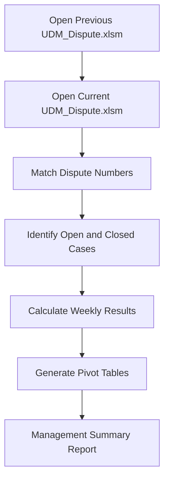
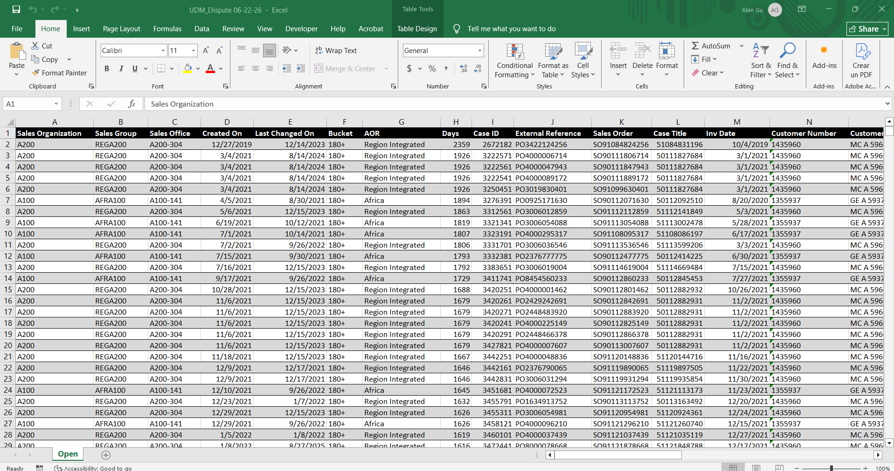
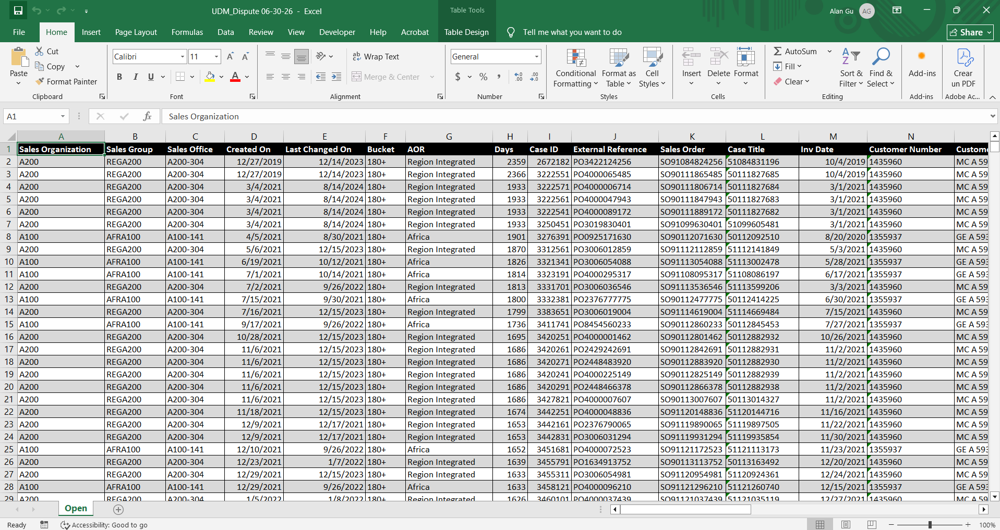
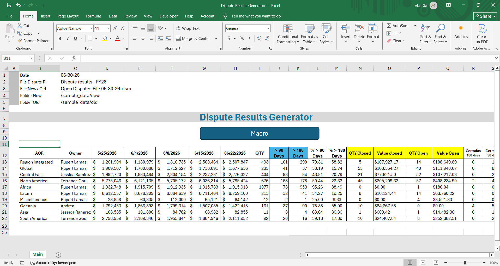
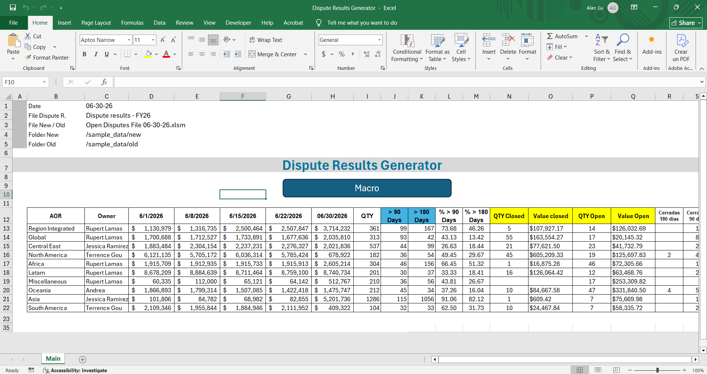

# customer-dispute-results-automation

## 📊 Project Overview
This VBA automation compares weekly customer dispute reports to identify newly closed and still-open disputes, then generates summary reports through Pivot Tables for business reporting.

The macro automatically opens the latest and previous UDM_Dispute workbooks, matches dispute records using the Dispute Number (Case ID), determines the current status of each dispute, and produces management-ready summaries showing open and closed disputes by customer region, monetary value, and aging.

By automating this weekly comparison, the solution eliminates repetitive manual reconciliation while providing faster and more reliable dispute performance reporting. 

## 💼 Business Problem
The dispute management team receives a new UDM_Dispute report every week containing all active customer disputes.
To understand weekly performance, analysts must compare the current report against the previous week's report to determine:

- Which disputes remain open
- Which disputes have been resolved
- Total open dispute value
- Total closed dispute value
- Aging of open disputes
- Regional dispute performance

Performing this comparison manually involved:
- Opening multiple Excel workbooks
- Comparing thousands of dispute records
- Matching Case IDs
- Identifying closed disputes
- Creating Pivot Tables
- Summarizing regional metrics
- Preparing management reports

As the dispute database grows, this process becomes increasingly time-consuming and susceptible to human error.

## ⚙️ Skills Developed

#### 🛠️ Tools

`Microsoft Excel` `VBA` `Excel Object Model` `Pivot Tables` `Dictionaries` `AutoFilter` `Git` `GitHub`

#### VBA & Excel Automation

- VBA Macro Development
- Workbook & Worksheet Automation
- Automated File Processing
- Excel Object Model
- Automated Pivot Table Generation
- Pivot Table Refresh & Management
- Automated Report Generation

#### Data Processing & Reconciliation

- Multi-Workbook Data Processing
- Weekly Dataset Comparison
- Data Matching & Reconciliation
- Unique Identifier-Based Record Matching
- Dispute Number / Case ID Matching
- Data Classification
- Data Validation
- Automated Status Identification

#### Time-Based Analysis

- Week-over-Week Comparison
- Historical Data Comparison
- Four-Week Performance Analysis
- Weekly Resolution Tracking
- Aging Analysis
- Open vs. Closed Dispute Analysis

#### Reporting & Analytics

- Pivot Table Reporting
- Operational KPI Reporting
- Dispute Volume Analysis
- Disputed Value Analysis
- Regional Performance Analysis
- Resolution Performance Analysis
- Aging Analysis
- Management Reporting

#### Process Automation

- End-to-End Workflow Automation
- Automated Data Reconciliation
- Repetitive Task Automation
- Standardized Weekly Reporting
- Automated Report Refresh
- Manual Effort Reduction
- Human Error Reduction
- Scalable Reporting Workflows

#### Business Analysis

- Customer Dispute Analysis
- Dispute Resolution Analysis
- Open vs. Closed Case Monitoring
- Financial Exposure Analysis
- Operational Performance Monitoring
- Trend Analysis
- Business Requirements Translation
- Data-Driven Decision Support

## 📂 Data Sources
The automation processes two Excel workbooks (new and latest):

    UDM_Dispute.xlsm

    - This the primary dispute database containing customer and invoice information.

## ⚙️ Automation Workflow
The VBA macro automates the complete weekly comparison process 

Step 1 – Load Weekly Reports:
- The macro prompts the user to open:
    - Previous week's UDM_Dispute
    - Current week's UDM_Dispute
- Each workbook contains information including:
    - AOR "Customer Region"
    - Days 
    - Case ID "Dispute Number"
    - External Reference "Purchase Order"
    - Sales Order
    - Case Title "Invoice Number"
    - Inv Date
    - Customer Number
    - Customer Name
    - Cause Desc
    - Disputed Amount
    - Processor Name "Dispute Responsible"

Step 2 – Match Disputes: 
- Using Dispute Number (Case ID) as the unique identifier, the macro compares both reports.
- Each dispute is classified as:
    - Open
    - Closed
- This automated comparison removes the need for manual record matching.

Step 3 – Generate Pivot Tables: 
- The automation creates Pivot Tables summarizing dispute activity.
- Reports include:
    - Total open disputes 
    - Total closed disputes
    - Open dispute value
    - closed dispute value
    - number of resolved cases during the week
    - Aging of disputes open
    - Aging of disputes closed
    - Comparison with previous 4 weeks
    - Weekly resolution metrics
- These summaries provide management with an immediate overview of dispute performance.

Step 4 – Produce Final Report
- The completed workbook contains fully refreshed Pivot Tables ready for review, eliminating manual report preparation.

## 📈 Key Insights
- Automatically opens weekly dispute reports
- Compares current and previous datasets
- Matches records using Case ID
- Identifies newly closed disputes
- Generates Pivot Tables automatically
- Determines remaining open disputes
- Calculates dispute values
- Summarizes dispute aging
- Produces management-ready reports
- Eliminates manual reconciliation

## 📈 Workflow

### Macro Execution
- The animation below demonstrates the complete automation workflow, from loading the source files to generating the dispute results ready to show.

### Source Workbook

### Macro Worksheet Table Before Running Macro

### Macro Worksheet Table After Running Macro

NOTE: the sample files included in this repository contain anonymized data to protect confidential business information.

## 💼 Business Impact

This automation significantly improves the efficiency of weekly dispute reporting by replacing a repetitive manual comparison process with a fully automated workflow.

Key Benefits: 
- Reduces report preparation time from hours to minutes
- Eliminates manual dispute matching
- Improves reporting accuracy
- Standardizes weekly dispute analysis
- Accelerates management reporting
- Enables faster visibility into dispute resolution performance
- Scales efficiently to datasets containing thousands of disputes

## ▶️ How to Run
1. git clone https://github.com/alangudi417/customer-dispute-results-automation.git
2. Open Dispute Results Generator.xlsm (Excel workbook where the VBA projects live)
3. Update the file paths for:
    - UDM_Dispute.xlsm (old folder)
    - UDM_Dispute.xlsm (new folder)
4. Run the Main macro.
    - Select:
        - Previous week's UDM_Dispute
        - Current week's UDM_Dispute
        - Wait for the automation to:
        - Compare dispute records
        - Identify open and closed cases
        - Generate Pivot Tables
        - Produce the final weekly report